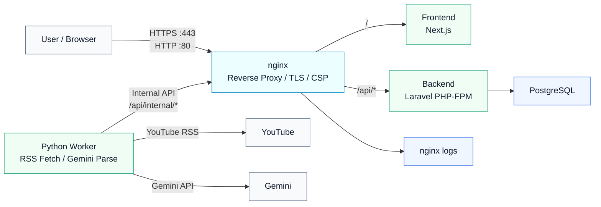

# youtube_free_anime

YouTubeで無料公開されているアニメ動画をまとめるサイトです。

## 技術構成

- Frontend: Next.js
- Backend API: Laravel / PHP-FPM
- Database: PostgreSQL
- Batch: Python / YouTube RSS / Gemini
- Web Server: nginx
- Local Environment: Docker Compose

## 開発環境の構築

### 1. リポジトリを取得

```bash
git clone https://github.com/YukihiroMaesato/youtube_free_anime.git
cd youtube_free_anime
```

### 2. 環境変数を作成

```bash
cp .env.example .env
cp backend/.env.example backend/.env
cp frontend/.env.example frontend/.env.local
```

必要に応じて次の値を設定してください。

```env
GEMINI_API_KEY=
YOUTUBE_API_KEY=
PYTHON_INTERNAL_API_TOKEN=
LARAVEL_API_URL=http://nginx_youtube_free_anime
```

`PYTHON_INTERNAL_API_TOKEN` は `backend/.env` とルート `.env` で同じ値にしてください。

### 3. コンテナを起動

```bash
docker compose up -d --build
```

### 4. 依存関係をインストール

```bash
docker compose exec backend_youtube_free_anime composer install
docker compose exec frontend_youtube_free_anime npm install
```

### 5. Laravel の初期設定

```bash
docker compose exec backend_youtube_free_anime php artisan key:generate
docker compose exec backend_youtube_free_anime php artisan migrate
docker compose exec backend_youtube_free_anime php artisan db:seed
```

### 6. アクセス確認

- アプリ: http://localhost:3001
- nginx経由: http://localhost:81
- APIヘルスチェック: http://localhost:81/api/health
- PostgreSQL: `127.0.0.1:5434`

### 7. Pythonで動画データを取得

PythonコンテナからRSS取得とGemini解析を実行します。

```bash
docker compose exec python_youtube_free_anime python main.py
```

PythonはLaravelの内部APIへ動画データを送信します。送信先は `LARAVEL_API_URL` で指定します。

## よく使うコマンド

```bash
# コンテナ起動
docker compose up -d

# コンテナ停止
docker compose down

# Laravelマイグレーション
docker compose exec backend_youtube_free_anime php artisan migrate

# フロントエンドlint
docker compose exec frontend_youtube_free_anime npm run lint

# フロントエンド型チェック
docker compose exec frontend_youtube_free_anime npx tsc --noEmit
```

## 本番環境の構成

本番環境では、外部からのHTTP/HTTPSリクエストはすべてnginxで受けます。nginxがパスに応じてNext.jsまたはLaravelへ振り分けます。



### nginxの役割

- `80` 番ポートでHTTPを受け、必要に応じてHTTPSへリダイレクト
- `443` 番ポートでHTTPSを終端
- `/` は Next.js へプロキシ
- `/api` は Laravel の `public/index.php` へルーティング
- YouTube iframe 等に必要なCSPヘッダーを付与
- アクセスログ・エラーログを出力
